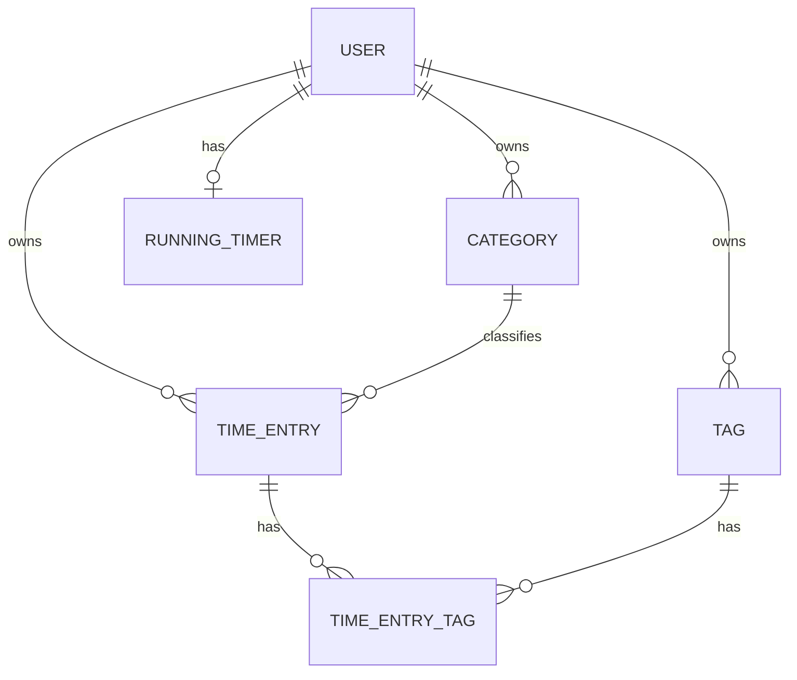
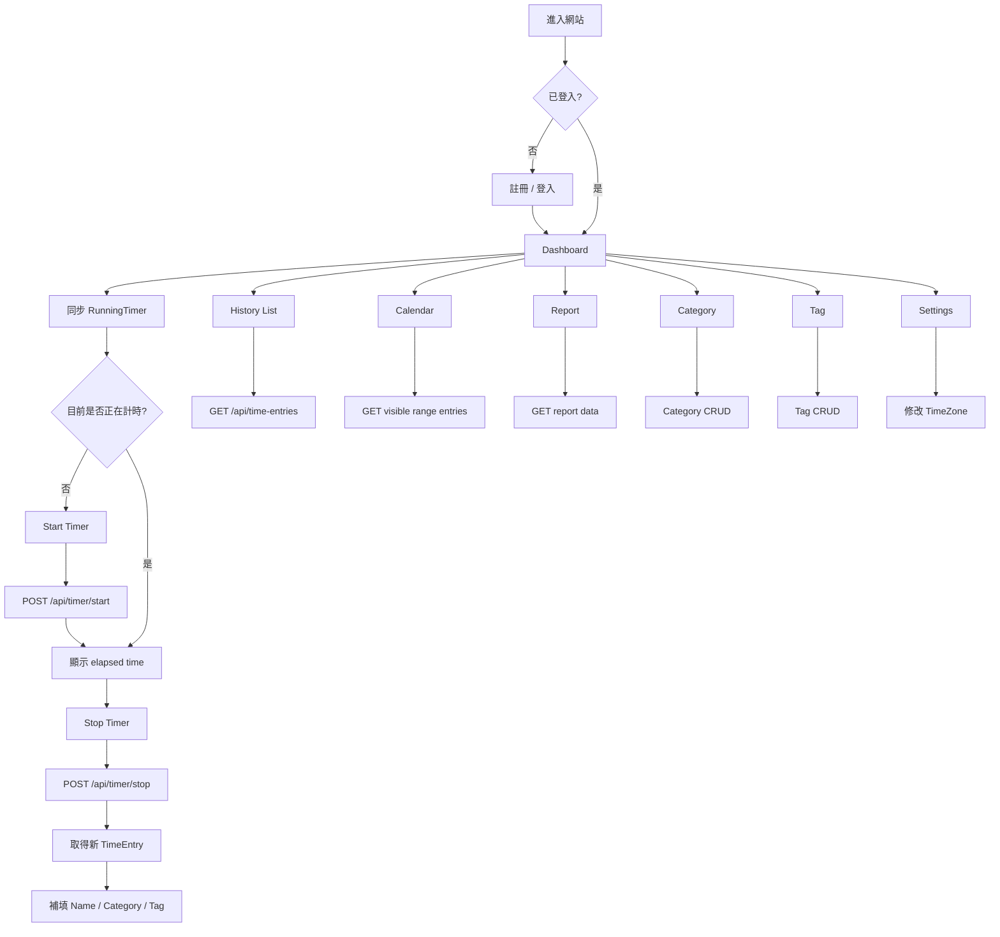
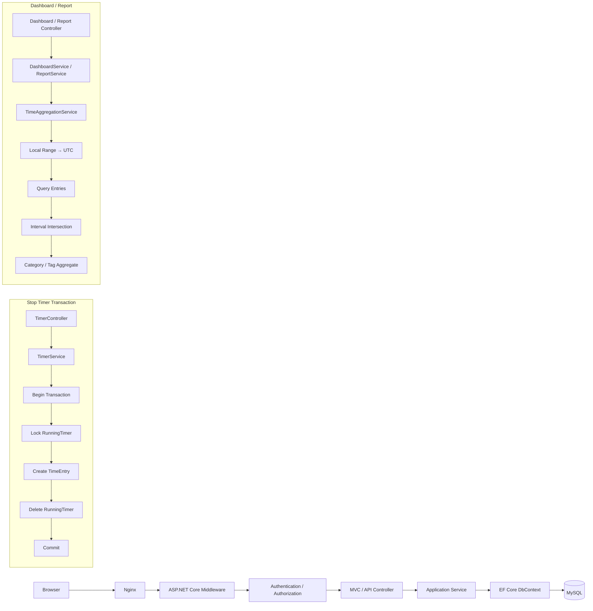

# 柳比歇夫時間管理 Web 應用程式
## 系統設計文件 v1.0

> 核心目標：精確記錄「時間花到哪裡」，並分析時間配置與長期趨勢。  
> 第一版不包含 AI 建議、多人協作、Workspace、訂閱、時間預算或任務規劃。

---

## 1. 技術範圍

| 層級 | 技術 |
|---|---|
| Backend | C# / ASP.NET Core MVC |
| Runtime | .NET 10 |
| ORM | Entity Framework Core 10 |
| MySQL Provider | Oracle MySQL Connector/NET / MySql.EntityFrameworkCore |
| Frontend | Razor View + HTML + CSS + JavaScript |
| AJAX | Fetch API |
| Database | MySQL / InnoDB |
| Authentication | Email + Password + JWT |
| Hosting | AWS EC2 |
| Reverse Proxy | Nginx |
| Architecture | Modular Monolith + Layered Architecture |
| UI | Desktop + Mobile RWD |
| Chart | 前端 JavaScript Chart Library |
| Export | CSV |

---

## 2. 系統角色

第一版只有一種角色：

- 一般使用者 User

所有資料均為私人資料：

- User A 無法存取 User B 的 TimeEntry。
- User A 無法存取 User B 的 Category。
- User A 無法存取 User B 的 Tag。
- User A 無法操作 User B 的 RunningTimer。

所有後端查詢都必須從 JWT 取得 `UserId`。

前端不得自行傳入一個可被信任的 UserId。

---

## 3. 核心使用流程

主要流程：

```text
登入
→ 開始 Timer
→ 工作
→ 停止 Timer
→ 產生 TimeEntry
→ 補活動名稱 / Category / Tag
→ 查看 Dashboard
→ 查看歷史
→ 定期查看 Report
```

系統同時允許直接手動新增 TimeEntry。

因此 Timer 只是建立 TimeEntry 的其中一種方式，不是 TimeEntry 的必要來源。

---

## 4. 帳號功能

第一版支援：

- 註冊
- 登入
- 登出

不包含：

- Email 驗證
- 忘記密碼
- 修改 Email
- 修改密碼
- OAuth
- 帳號分享

規則：

- Email 必須唯一。
- Password 僅要求基本安全強度。
- 資料庫只能保存 Password Hash，不得保存明文密碼。

---

## 5. JWT 認證設計

### 5.1 JWT 保存方式

採用：

```text
JWT → Secure + HttpOnly Cookie
```

而不是：

```text
JWT → localStorage
```

建議 Cookie 設定：

| 屬性 | 設計 |
|---|---|
| HttpOnly | true |
| Secure | true |
| SameSite | Lax |
| Path | `/` |
| JWT expiration | 建議預設 8 小時，可設定 |

JWT Claims 至少包含：

- `sub`：UserId
- `email`
- `jti`
- `iat`
- `exp`

### 5.2 CSRF

因為 Cookie 會自動隨 request 傳送，所以：

- POST
- PATCH
- PUT
- DELETE

都必須加入 Anti-CSRF 防護。

Razor Page 產生 Anti-forgery token，JavaScript 使用 Fetch 時把 token 放入 request header。

---

## 6. Timer 架構

不建議將「正在計時」表示為：

```text
TimeEntry.EndTime = NULL
```

而是建立獨立的：

```text
RunningTimer
```

原因：

- TimeEntry 代表已完成的事實紀錄。
- RunningTimer 代表目前正在進行的狀態。

資料流程：

```text
User
→ RunningTimer
→ Stop
→ TimeEntry
```

---

## 7. RunningTimer 規則

每個 User：

```text
最多只能有一筆 RunningTimer
```

RunningTimer 必要欄位：

- UserId
- StartedAtUtc

使用者不需要先輸入：

- Name
- Category
- Tag

所以按下 Start 就可以立即開始。

---

## 8. 跨裝置 Timer

假設：

```text
Desktop 10:00 Start
→ 關閉瀏覽器
→ Mobile 11:00 Login
```

Mobile 向伺服器查詢目前 RunningTimer，取得：

```text
StartedAtUtc
```

前端自行計算：

```text
目前時間 - StartedAtUtc
```

因此 Timer 並不是後端每秒累加數字。

Server 只保存：

```text
何時開始
```

這樣即使：

- 關閉 Browser
- Browser crash
- 換裝置
- JavaScript 停止執行

Timer 仍然存在。

---

## 9. Start Timer 流程

```text
Start Button
→ AJAX POST
→ Backend 驗證 JWT
→ TimerService
→ 嘗試建立 RunningTimer
→ Database
```

如果不存在 Timer：

```text
Success
```

如果已存在：

```text
409 TIMER_ALREADY_RUNNING
```

前端取得既有 Timer 並同步畫面。

---

## 10. Stop Timer 流程

Stop 必須使用 Database Transaction。

```text
取得 RunningTimer
→ 鎖定該 Timer
→ Server 取得目前 UTC 時間作為 EndTime
→ 建立 TimeEntry
→ 刪除 RunningTimer
→ Commit
→ 回傳 TimeEntry
```

目的：

避免 Desktop 與 Mobile 同時按 Stop，導致建立兩筆重複 TimeEntry。

---

## 11. 長時間 Timer

系統允許 Timer 執行非常久。

- 不自動停止。
- 超過門檻只顯示 Warning。
- Warning 不阻止繼續計時。

建議預設：

```text
LongTimerWarningHours = 24
```

此值應由設定管理，而不是硬編碼。

---

## 12. TimeEntry

一筆完成的 TimeEntry 必須有：

- StartTime
- EndTime

可選：

- Name
- Category
- Tags

合法範例：

```text
14:00 → 15:00
Name = NULL
Category = NULL
Tags = []
```

使用者可以日後補上。

---

## 13. 手動 TimeEntry

使用者可以直接建立：

```text
StartTime + EndTime
```

不必先啟動 Timer。

驗證規則：

```text
EndTime > StartTime
```

系統允許 TimeEntry 重疊。

例如：

| Activity | 時間 |
|---|---|
| Reading | 10:00–11:00 |
| Coding | 10:30–12:00 |

統計結果：

```text
1h + 1.5h = 2.5h
```

不是 2 小時。

因此系統的 Tracked Time 代表：

```text
活動時間總和
```

而不是現實世界不重複經過時間。

---

## 14. Category

Category 為單層分類。

每一筆 TimeEntry：

```text
0..1 Category
```

Category 欄位：

- Id
- UserId
- Name
- Color
- CreatedAtUtc
- UpdatedAtUtc

支援：

- Create
- Read
- Update
- Delete
- 修改 Color

Calendar 上 TimeEntry block 使用 Category.Color。

沒有 Category 時使用系統預設 neutral color。

---

## 15. Category 刪除規則

Category 被刪除：

```text
TimeEntry 保留
CategoryId = NULL
```

資料庫 Foreign Key：

```text
ON DELETE SET NULL
```

---

## 16. Tag

Tag 是自由標籤。

例如：

- C#
- Reading
- SideProject

Tag 可以：

1. 在 Tag 管理頁建立。
2. 在編輯 TimeEntry 時直接輸入新 Tag。

如果 Tag 不存在：

```text
自動建立 Tag
```

TimeEntry：

```text
0..N Tag
```

因此：

```text
TimeEntry ↔ Tag = Many-to-Many
```

---

## 17. Tag 刪除規則

刪除 Tag：

```text
刪除 TimeEntryTag relation
→ 保留 TimeEntry
```

---

## 18. 資料模型

### 18.1 Users

| Column | Type | Constraint |
|---|---|---|
| Id | BIGINT UNSIGNED | PK |
| Email | VARCHAR(255) | UNIQUE NOT NULL |
| PasswordHash | VARCHAR(512) | NOT NULL |
| TimeZoneId | VARCHAR(100) | NOT NULL |
| CreatedAtUtc | DATETIME(6) | NOT NULL |
| UpdatedAtUtc | DATETIME(6) | NOT NULL |

### 18.2 RunningTimers

| Column | Type | Constraint |
|---|---|---|
| UserId | BIGINT UNSIGNED | PK + FK |
| StartedAtUtc | DATETIME(6) | NOT NULL |

`UserId` 本身就是 Primary Key。

因此 Database 層天然禁止：

```text
一個 User 同時存在兩個 RunningTimer
```

### 18.3 Categories

| Column | Type |
|---|---|
| Id | BIGINT UNSIGNED PK |
| UserId | BIGINT UNSIGNED FK |
| Name | VARCHAR(100) |
| Color | VARCHAR(20) |
| CreatedAtUtc | DATETIME(6) |
| UpdatedAtUtc | DATETIME(6) |

Index：

```text
(UserId, Name)
```

### 18.4 Tags

| Column | Type |
|---|---|
| Id | BIGINT UNSIGNED PK |
| UserId | BIGINT UNSIGNED FK |
| Name | VARCHAR(100) |
| CreatedAtUtc | DATETIME(6) |
| UpdatedAtUtc | DATETIME(6) |

建議 Unique：

```text
UNIQUE(UserId, Name)
```

### 18.5 TimeEntries

| Column | Type | Constraint |
|---|---|---|
| Id | BIGINT UNSIGNED | PK |
| UserId | BIGINT UNSIGNED | FK NOT NULL |
| CategoryId | BIGINT UNSIGNED | FK NULL |
| Name | VARCHAR(255) | NULL |
| StartTimeUtc | DATETIME(6) | NOT NULL |
| EndTimeUtc | DATETIME(6) | NOT NULL |
| CreatedAtUtc | DATETIME(6) | NOT NULL |
| UpdatedAtUtc | DATETIME(6) | NOT NULL |

重要 Index：

```text
(UserId, StartTimeUtc)
(UserId, CategoryId, StartTimeUtc)
```

用途：

- History
- Calendar
- Dashboard
- Report

### 18.6 TimeEntryTags

| Column | Type |
|---|---|
| TimeEntryId | BIGINT UNSIGNED FK |
| TagId | BIGINT UNSIGNED FK |

Composite Primary Key：

```text
(TimeEntryId, TagId)
```

刪除 TimeEntry：

```text
CASCADE relation
```

刪除 Tag：

```text
CASCADE relation
```

只刪 join-table relation。

---

## 19. Entity Relationship



---

## 20. 時間與時區設計

Database：

```text
全部保存 UTC
```

例如台灣使用者輸入：

```text
2026-09-17 10:00 Asia/Taipei
```

Backend 轉換：

```text
2026-09-17 02:00 UTC
```

Database 保存 UTC。

顯示時：

```text
UTC
→ User.TimeZoneId
→ Local DateTime
```

---

## 21. 使用者 TimeZone

User 可以：

- 查看目前 TimeZone
- 修改 TimeZone

Timezone 修改：

```text
不修改歷史 TimeEntry 的 UTC timestamp
```

只改變：

```text
如何呈現時間
```

因此同一筆 UTC 資料在不同時區可能顯示於不同日期。

---

## 22. Date Range 計算

使用者在 Report 選：

```text
2026/09/01 ~ 2026/09/30
```

這表示：

```text
使用者目前 TimeZone 下的日期範圍
```

Application Service：

```text
Local start/end
→ UTC start/end
→ Database Query
```

不能直接把 Browser 的 local timestamp 當作 Database timestamp。

---

## 23. 跨午夜統計

假設 TimeEntry：

```text
23:00 → 01:00
```

查詢某日：

```text
00:00 → 24:00
```

不能單純依 `StartTime` 判斷。

應使用：

```text
TimeEntry 與查詢區間的 intersection
```

例如：

```text
23:00 → 01:00
```

在次日只計：

```text
00:00 → 01:00
```

---

## 24. Dashboard

預設：

```text
Today
```

允許：

- Today
- This Week
- This Month
- Custom Range

### 24.1 Total Tracked Time

```text
SUM(TimeEntry duration within range)
```

### 24.2 Category Distribution

顯示：

- Category
- Duration
- Percentage

必須包含：

```text
Uncategorized
```

否則 Pie Chart 無法完整代表總 tracked time。

### 24.3 Tag Distribution

顯示：

- Tag
- Duration

因為一筆 TimeEntry 可以有多個 Tag：

```text
1 hour + Tag A + Tag B
```

則：

```text
Tag A = 1 hour
Tag B = 1 hour
```

因此 Tag 加總可能大於 Total Tracked Time。

Tag 不適合使用 Pie Chart 表達整體比例。

### 24.4 Daily Tracked Time

顯示選定範圍內每日 tracked time。

---

## 25. Report

Report 定位：

```text
詳細時間配置分析
```

User 選：

```text
From
To
```

顯示兩張圖：

### 25.1 Category Pie Chart

```text
Category
→ Duration
→ Percentage
```

包含：

```text
Uncategorized
```

### 25.2 Tag Bar Chart

X：

```text
Tag
```

Y：

```text
Tracked Duration
```

不計算成總時間百分比。

---

## 26. History

History 提供兩種 View：

### 26.1 List View

依：

```text
newest → oldest
```

顯示：

- Date
- Start
- End
- Duration
- Name
- Category
- Tags

支援：

- Edit
- Delete

### 26.2 Calendar View

第一版：

```text
只顯示，不直接拖拉編輯
```

Desktop：

- Week / Day 時間軸

Mobile：

- Day-oriented layout

TimeEntry：

- 依 Category.Color 呈現
- 無 Category 使用 neutral color

跨午夜 TimeEntry：

- UI 可以分成兩個 visual block
- 但仍指向同一筆 TimeEntry

---

## 27. CSV Export

使用者可以依日期範圍匯出 TimeEntry。

建議欄位：

- Date
- Start Time
- End Time
- Duration
- Name
- Category
- Tags
- Time Zone

輸出時間：

```text
依使用者目前設定的 TimeZone
```

Tags 可以輸出：

```text
C#;Reading;Backend
```

CSV 建議使用 streaming response。

---

## 28. 系統架構

整體採：

```text
Modular Monolith
```

而不是 Microservices。

原因：

- 約 1,000 users
- 單一產品
- 單一 Database
- 商務領域不複雜
- 部署在單一 EC2
- 優先正確性與可維護性

---

## 29. 分層架構

### 29.1 Presentation Layer

包含：

- MVC Controllers
- API Controllers
- Razor Views
- ViewModels
- JavaScript
- HTML
- CSS

職責：

- 接收 Request
- Input Validation
- 呼叫 Application Service
- 回傳 View / JSON
- UI rendering

### 29.2 Application Layer

包含：

- AuthService
- TimerService
- TimeEntryService
- CategoryService
- TagService
- DashboardService
- ReportService
- CsvExportService
- UserSettingsService

負責：

```text
Use Case / Business Workflow
```

### 29.3 Domain Layer

核心 Entity：

- User
- RunningTimer
- TimeEntry
- Category
- Tag

### 29.4 Infrastructure Layer

包含：

- EF Core
- AppDbContext
- MySQL
- JWT creation / validation
- PasswordHasher
- CSV implementation
- Logging
- System Clock abstraction

---

## 30. Repository 決策

第一版不建議額外建立：

```text
GenericRepository<T>
```

原因：

- EF Core 的 DbContext 已經提供 Unit of Work 與資料存取抽象。
- 再包一層 Generic Repository 只會增加樣板程式。

只有未來真的出現多資料來源或 Domain Repository 需求時再增加。

---

## 31. MVC Controller

建議：

| Controller | View |
|---|---|
| AccountController | Login / Register |
| DashboardController | Dashboard |
| TimeEntryController | History / Calendar |
| ReportController | Report |
| CategoryController | Category Management |
| TagController | Tag Management |
| SettingsController | User Settings |

流程：

```text
MVC Controller
→ Service
→ ViewModel
→ Razor View
```

---

## 32. AJAX API Controller

建議 Endpoint：

| Endpoint | Purpose |
|---|---|
| GET `/api/timer` | Current timer |
| POST `/api/timer/start` | Start |
| POST `/api/timer/stop` | Stop |
| GET `/api/time-entries` | Query entries |
| POST `/api/time-entries` | Manual create |
| PATCH `/api/time-entries/{id}` | Edit |
| DELETE `/api/time-entries/{id}` | Delete |
| GET `/api/categories` | Categories |
| POST `/api/categories` | Create |
| PATCH `/api/categories/{id}` | Update |
| DELETE `/api/categories/{id}` | Delete |
| GET `/api/tags` | Tags |
| POST `/api/tags` | Create |
| PATCH `/api/tags/{id}` | Update |
| DELETE `/api/tags/{id}` | Delete |
| GET `/api/dashboard` | Dashboard stats |
| GET `/api/reports/category` | Category report |
| GET `/api/reports/tag` | Tag report |
| GET `/api/time-entries/export` | CSV |
| PATCH `/api/settings/timezone` | Change timezone |

---

## 33. API Ownership Security

例如：

```text
DELETE /api/time-entries/123
```

Backend 不得只做：

```text
DELETE WHERE Id = 123
```

而必須等價於：

```text
DELETE WHERE Id = 123
AND UserId = authenticatedUserId
```

同樣規則適用：

- TimeEntry
- Category
- Tag
- RunningTimer

---

## 34. Category / Tag 關聯安全

使用者修改 TimeEntry：

```text
CategoryId = 20
```

Backend 不能只檢查 Category 20 是否存在。

還必須確認：

```text
Category 20 belongs to current User
```

Tag 同理。

---

## 35. 前端架構

Frontend 不是 SPA。

頁面主要由：

```text
Razor Server Rendering
```

建立。

JavaScript 只負責：

- Timer
- CRUD modal
- Chart
- Calendar data refresh
- AJAX
- CSV action
- Dynamic Tag input
- Date-range change

---

## 36. JavaScript 模組

建議：

```text
timer.js
time-entry.js
calendar.js
dashboard.js
report.js
category.js
tag.js
settings.js
```

### timer.js

負責：

- Start
- Stop
- Sync current timer
- elapsed display
- warning

### time-entry.js

負責：

- Create
- Edit
- Delete

### calendar.js

負責：

- Load visible range
- Render TimeEntry blocks

### dashboard.js

負責：

- Date range
- Fetch stats
- Update charts

### report.js

負責：

- Category chart
- Tag chart

---

## 37. CSS / RWD

至少兩種切版。

### Desktop

建議：

```text
>= 768px
```

- Sidebar navigation
- Dashboard multi-column cards
- Calendar week layout
- Report two-column chart layout
- History table/list

### Mobile

建議：

```text
< 768px
```

- Bottom navigation 或 compact top navigation
- Dashboard cards vertical stack
- Calendar day-oriented view
- Report charts vertical stack
- TimeEntry list card layout
- Timer Start / Stop 保留明顯主操作區

---

## 38. Calendar Query

Calendar 不應一次下載全部 TimeEntry。

前端只傳：

```text
visibleFrom
visibleTo
```

例如：

```text
September 14–20
```

Backend 只查與這個 interval 有交集的 entries。

判定條件：

```text
Entry.Start < Range.End
AND
Entry.End > Range.Start
```

---

## 39. Dashboard / Report Query Strategy

第一版約 1,000 users：

不需要：

- Redis
- Elasticsearch
- Materialized analytics table
- Message Queue

直接使用：

```text
MySQL Aggregate Query
```

即可。

未來資料量大幅增加時，再考慮：

- daily aggregate table
- caching
- background aggregation

---

## 40. Error Handling

Backend：

```text
Exception
→ Global Exception Handler
→ application log
→ standard error response
```

Frontend 顯示統一訊息：

```text
發生錯誤，請稍後再試。
```

不得把以下資訊直接傳給 Browser：

- stack trace
- SQL
- Connection String
- internal exception

---

## 41. HTTP 錯誤設計

| HTTP | Meaning |
|---|---|
| 400 | Validation failure |
| 401 | Not authenticated |
| 403 | Forbidden |
| 404 | Resource not found |
| 409 | State conflict |
| 500 | Unexpected server error |

例如：

```text
TIMER_ALREADY_RUNNING
```

應回：

```text
409
```

而不是 500。

---

## 42. Logging

第一版只做 Application Log。

至少記錄：

- startup
- shutdown
- unexpected exception
- database error
- authentication failure summary
- timer transaction failure
- CSV export failure

禁止寫入：

- Password
- JWT
- Authorization Cookie
- Connection String password

---

## 43. Rate Limiting

Login / Register 建議增加基本 rate limit。

目的：

- 避免暴力登入嘗試
- 避免短時間大量註冊或登入 request

---

## 44. Database Transaction

以下流程必須 transaction：

### Stop Timer

```text
1. Lock RunningTimer
2. Insert TimeEntry
3. Delete RunningTimer
4. Commit
```

任何一步失敗：

```text
Rollback
```

不能發生：

```text
TimeEntry 建立成功
但 RunningTimer 還存在
```

---

## 45. Delete Category

Database：

```text
Categories
→ FK
→ TimeEntries.CategoryId
```

設定：

```text
ON DELETE SET NULL
```

---

## 46. Delete Tag

Database：

```text
Tags
→ TimeEntryTags
```

設定：

```text
ON DELETE CASCADE
```

只 cascade join record。

不 cascade TimeEntry。

---

## 47. Authentication Flow

### Register

```text
Browser
→ Register Form
→ MVC Controller
→ Validate
→ PasswordHasher
→ User insert
→ Redirect Login
```

### Login

```text
Browser
→ Login Form
→ AccountController
→ User lookup
→ Password verification
→ Generate JWT
→ Set HttpOnly Cookie
→ Redirect Dashboard
```

### Authenticated Request

```text
Browser
→ Request
→ Authentication Middleware
→ JWT validation
→ ClaimsPrincipal
→ Controller
```

### Logout

```text
POST Logout
→ Delete auth cookie
→ Redirect Login
```

---

## 48. CSRF Flow

```text
Razor page 產生 Anti-forgery token
→ JavaScript Fetch
→ Anti-forgery token header
→ Cookie JWT 自動傳送
→ Backend 驗證 JWT + Antiforgery token
→ 執行 mutation
```

---

## 49. CSV Flow

```text
User
→ Export CSV
→ Controller
→ CsvExportService
→ Query selected range
→ Convert UTC → User timezone
→ Stream CSV response
→ Browser download
```

---

## 50. 專案資料夾結構

建議：

```text
Controllers/
Controllers/Api/

Models/
  Entities/
  ViewModels/
  Requests/
  Responses/

Services/

Data/
  AppDbContext
  Configurations/
  Migrations/

Security/

Infrastructure/

Views/

wwwroot/
  css/
  js/
```

---

## 51. Dependency Direction

```text
Browser
↓
Controller
↓
Application Service
↓
DbContext / Infrastructure
↓
MySQL
```

Controller 不應直接包含大量 EF query 與統計商務規則。

---

## 52. Deployment Architecture

```text
Internet
↓
AWS Security Group
↓
Nginx :443
↓
Kestrel / ASP.NET Core localhost
↓
MySQL localhost:3306
```

---

## 53. EC2 Network

Public：

```text
443 HTTPS
```

可選：

```text
80 HTTP → redirect 443
```

SSH：

```text
22
```

應限制來源 IP。

MySQL：

```text
3306 不對 Internet 開放
```

因為 Application 與 MySQL 在同一台 EC2：

MySQL 應只監聽 localhost / private interface。

---

## 54. EC2 Process

建議：

```text
Nginx
+
ASP.NET Core Kestrel
+
MySQL
```

ASP.NET Core Application：

使用 `systemd` 負責：

- process startup
- automatic restart
- service status

---

## 55. Single Point of Failure

Application 與 Database 都在同一台 EC2。

因此：

```text
EC2 故障
=
Application + Database 同時離線
```

第一版可以接受，但必須至少有：

```text
Database Backup Strategy
```

建議：

```text
每日 database backup
→ S3 / 外部儲存
```

---

## 56. Secret Management

以下不能 Commit 到 Git：

- JWT signing key
- Database password
- Connection String credential

Development：

- User Secrets
- Environment Variables

Production：

- Protected environment configuration
- AWS secret solution

---

## 57. HTTPS

Production：

```text
HTTPS only
```

JWT Cookie：

```text
Secure = true
```

HTTP：

```text
redirect HTTPS
```

---

## 58. 效能設計

目標：

```text
約 1,000 registered users
```

目前不需要：

- microservice
- Kubernetes
- Redis
- distributed cache
- load balancer
- message queue
- database replication

優先：

```text
正確性
+
可維護性
+
資料一致性
```

---

## 59. Database Index

最重要：

### TimeEntry

```text
INDEX(UserId, StartTimeUtc)
```

### Tag

```text
UNIQUE(UserId, Name)
```

### User

```text
UNIQUE(Email)
```

### Category

```text
INDEX(UserId, Name)
```

---

## 60. Pagination

History List 不應一次讀出所有紀錄。

建議：

```text
50 entries / page
```

Calendar 則依 visible range query。

---

## 61. Statistics Calculation Service

建議建立：

```text
TimeAggregationService
```

負責：

- timezone conversion
- interval intersection
- duration calculation
- category aggregate
- tag aggregate

DashboardService 和 ReportService 共用。

目的：

避免不同頁面使用不同統計規則。

---

## 62. Time Source

Backend 建議抽象出：

```text
Clock
```

而不是 Service 到處直接讀系統時間。

目的：

提升 Timer Unit Test 可測試性。

---

## 63. Testing Strategy

### Unit Test

優先測試：

- Duration
- interval intersection
- cross-midnight
- timezone conversion
- overlapping entries
- Category aggregate
- Tag aggregate
- Timer state

### Integration Test

測試：

- Register
- Login
- Start Timer
- Stop Timer
- CRUD TimeEntry
- Category SET NULL
- Tag relation deletion
- cross-user access rejection

### UI / Manual Test

至少確認：

- Desktop
- Mobile
- Calendar
- Dashboard
- Report
- CSV

---

## 64. 重要 Edge Cases

| 情境 | 預期 |
|---|---|
| Start while Timer running | 409 |
| Two devices Stop simultaneously | only one TimeEntry |
| Browser closed | Timer continues |
| User changes timezone | stored UTC unchanged |
| Category deleted | CategoryId → NULL |
| Tag deleted | relation removed |
| TimeEntry overlap | allowed |
| Overlap statistics | durations added |
| Empty Name | allowed |
| No Category | allowed |
| No Tag | allowed |
| TimeEntry crosses midnight | split logically during stats |
| TimeEntry >24h | allowed |
| Running Timer > warning threshold | warning only |

---

## 65. Acceptance Criteria

### Authentication

User 可以：

- 註冊
- 登入
- 登出

未登入使用者不能存取私人頁面。

### Timer

User 可以：

```text
Start
→ 關閉 Browser
→ 換 Device
→ 看見相同 RunningTimer
→ Stop
→ 建立一筆 TimeEntry
```

### TimeEntry

User 可以：

- manual create
- edit
- delete
- overlap entries

### Category

User 可以：

- create
- edit
- change color
- delete

刪除後 TimeEntry 保留。

### Tag

User 可以：

- create
- inline create
- edit
- delete

TimeEntry 可同時有多個 Tag。

### History

User 可以：

- List View
- Calendar View

### Dashboard

User 可以切換時間範圍並查看：

- total
- Category
- Tag
- daily tracked time

### Report

User 可以查看：

- Category Pie Chart
- Tag Bar Chart

### Export

User 可以依日期範圍 Export CSV。

### Settings

User 可以修改 TimeZone。

### UI

Desktop 與 Mobile 都可以：

- Start / Stop
- History
- Dashboard
- Report

---

## 66. 建議開發順序

```text
Phase 1 — Foundation
Project / MySQL / EF Core / User / JWT

↓

Phase 2 — Core Time Tracking
RunningTimer / Start / Stop / Manual TimeEntry

↓

Phase 3 — Metadata
Category / Color / Tag / TimeEntryTag

↓

Phase 4 — History
List / Edit / Delete / Pagination

↓

Phase 5 — Calendar
Date-range query / time blocks / category color

↓

Phase 6 — Statistics
TimeAggregationService / Dashboard

↓

Phase 7 — Report
Category Pie / Tag Bar

↓

Phase 8 — User Settings
Timezone

↓

Phase 9 — Export
CSV

↓

Phase 10 — Production
RWD / Exception handling / Logging / Rate limit / Nginx / EC2 / Backup
```

---

## 67. 核心架構決策摘要

| 決策 | 結果 |
|---|---|
| Architecture | Modular Monolith |
| Backend UI model | MVC + Razor |
| Dynamic UI | Fetch/AJAX |
| Running timer | Separate RunningTimer table |
| Completed record | TimeEntry |
| Timer uniqueness | RunningTimer.UserId PK |
| Persistence | EF Core + MySQL |
| Timestamp | UTC |
| Display timezone | Per User |
| Category | 0..1 per TimeEntry |
| Tag | 0..N per TimeEntry |
| Category delete | SET NULL |
| Tag delete | delete relation |
| Overlap | allowed |
| Overlap stats | additive |
| Auth | JWT in HttpOnly Secure Cookie |
| CSRF | Antiforgery required |
| Scale | Single EC2 monolith |
| Cache | none initially |
| Database | same EC2 |
| UI | Desktop + Mobile RWD |
| Calendar editing | display-only V1 |
| Export | CSV |

---

## 68. 前端系統流程圖



---

## 69. 後端系統流程圖



---

## 70. 系統定位

第一版應刻意維持：

```text
小而完整的時間追蹤系統
```

不要擴張成：

- Task Manager
- Calendar Planner
- AI Productivity Assistant

核心 Domain：

```text
使用者記錄時間
+
從時間記錄理解自己的時間配置
```
